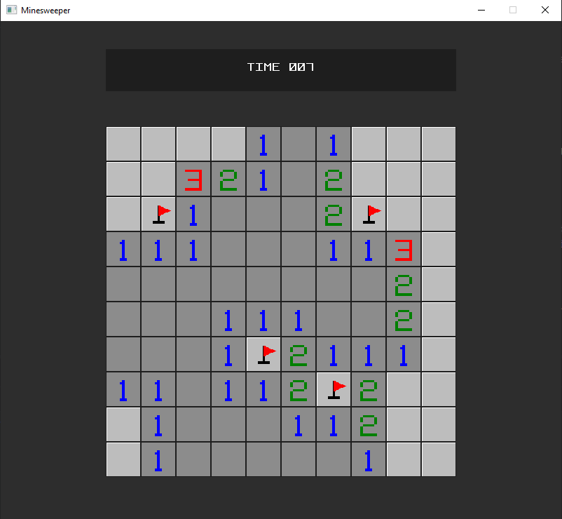

# Minesweeper
## Description
Minesweeper is a puzzle game where you have to find the hidden mines on the board. The first move is always safe and opens a part of the board.
- Clicking on a safe cell reveals the number of mines which are touching that cell
- Clicking on a mine ends the game
- Right clicking places a flag

There are currently 3 difficulties which can be picked in the main menu:
- Easy (8x8) 10 mines
- Medium (10x10) 15 mines
- Hard (14x14) 35 mines

## Build & run instructions
- dotnet build
- dotnet run

## AI Usage
I used Gemini 3.5 Flash to generate a vector font which is used in the main menu, displaying the timer and ending screen. It was also used to fix a dll issue during development.
